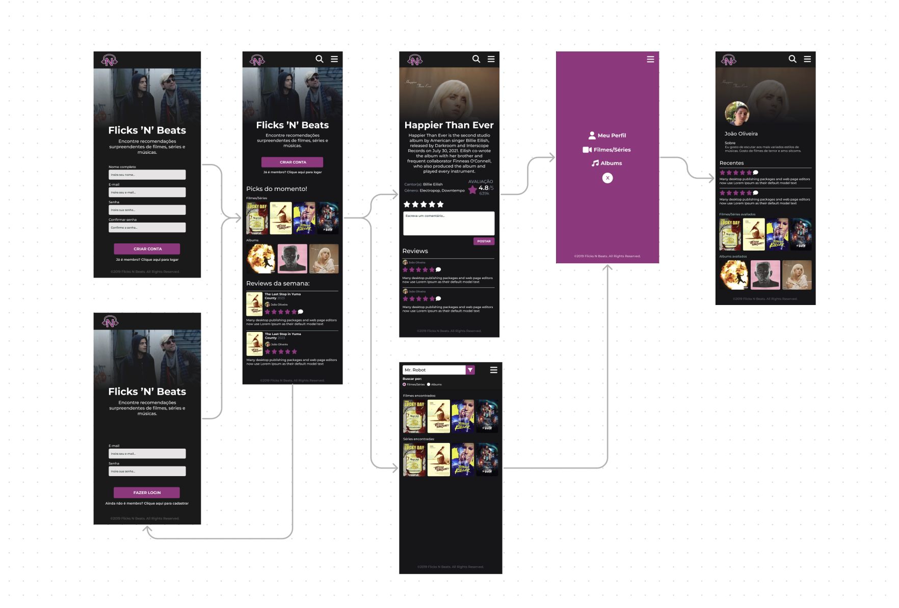

# Projeto de Interface

O Projeto de Inteface contém 6 sessões: Login, Cadastro, Página Inicial, Página de Conteúdo Específico, Página de Busca e Perfil do Usuário. As páginas foram projetadas para tornar mais fácil a experiência dos usuários que estão acostumados com interações na web. Cada página possui um layout claro e direciona de maneira direta para a função desejada.

## User Flow

## Wireframes

### Tela de cadastro mobile

### Tela de login mobile

### Tela main mobile

### Tela de filme mobile

### Tela de perfil mobile

### Tela de pesquisa mobile

### Tela de filtro mobile

### Tela de menu mobile

### Tela de cadastro desktop

### Tela de login desktop

### Tela main desktop

### Tela de filme desktop

### Tela de perfil desktop

### Tela de pesquisa desktop

### Tela de filtro desktop

