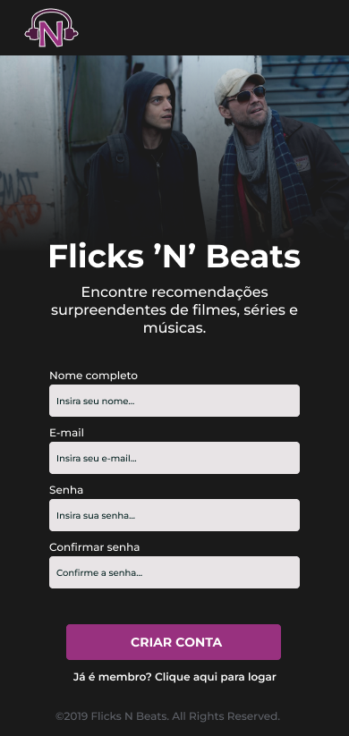
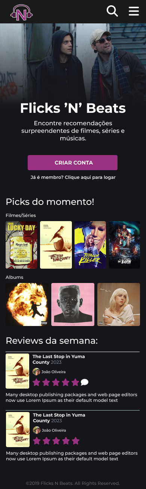
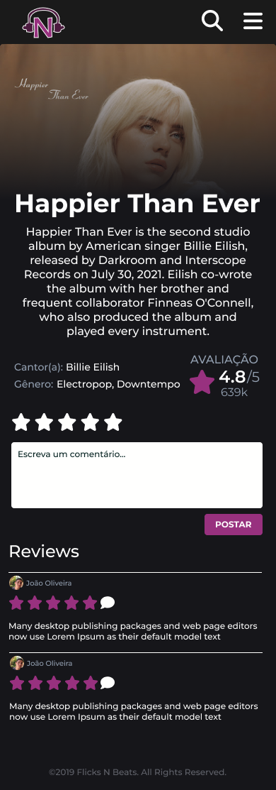
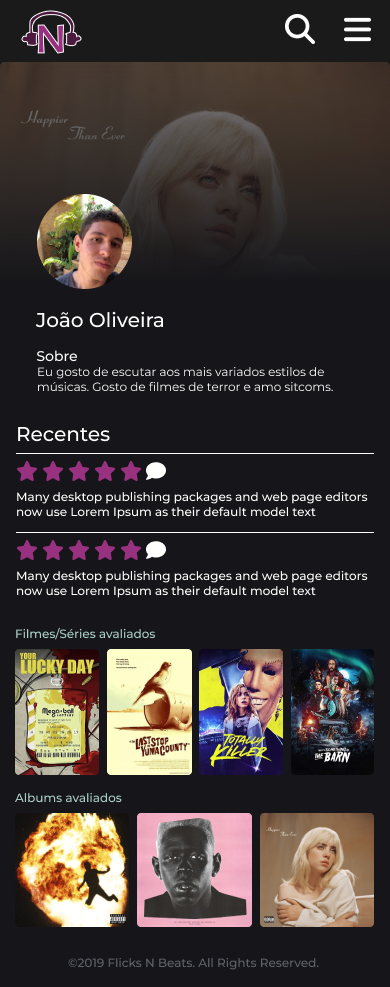
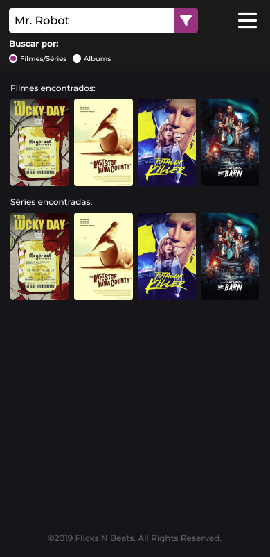
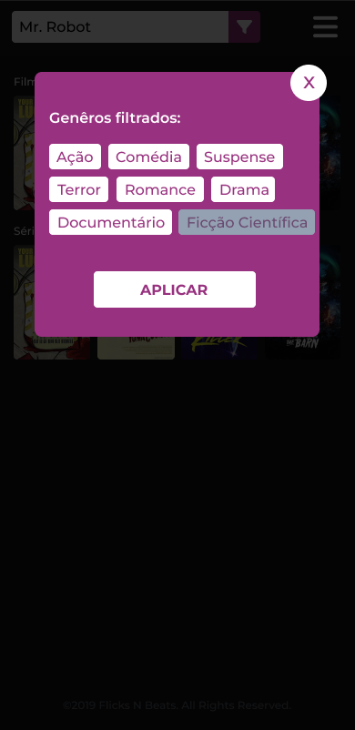
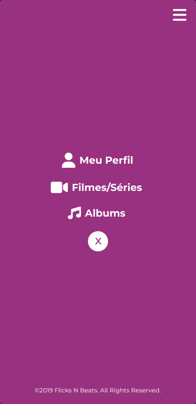

# Projeto de Interface

O Projeto de Inteface contém 6 sessões: Login, Cadastro, Página Inicial, Página de Conteúdo Específico, Página de Busca e Perfil do Usuário. As páginas foram projetadas para tornar mais fácil a experiência dos usuários que estão acostumados com interações na web. Cada página possui um layout claro e direciona de maneira direta para a função desejada.

## User Flow

## Wireframes

São protótipos usados em design de interface para sugerir a estrutura de um site web e seu relacionamentos entre suas páginas. Um wireframe web é uma ilustração semelhante do layout de elementos fundamentais na interface.

### Exemplo

A tela Inicial apresenta um menu lateral com as principais seções do portal, enquanto a navigation bar, ao topo, apresenta informações de envio de imagens ou navegação pela galeria de fotos. A área central apresenta a galeria de fotos na forma de uma grade.

### Mobile

Tela de cadastro mobile

Tela de login mobile

Tela main mobile

Tela de filme mobile

Tela de perfil mobile

Tela de pesquisa mobile

Tela de filtro mobile

Tela de menu mobile

### Desktop

Tela de cadastro desktop

Tela de login desktop

Tela main desktop

Tela de filme desktop

Tela de perfil desktop

Tela de pesquisa desktop

Tela de filtro desktop

> **Links Úteis**:
>
> - [Protótipos vs Wireframes](https://www.nngroup.com/videos/prototypes-vs-wireframes-ux-projects/)
> - [Ferramentas de Wireframes](https://rockcontent.com/blog/wireframes/)
> - [MarvelApp](https://marvelapp.com/developers/documentation/tutorials/)
> - [Figma](https://www.figma.com/)
> - [Adobe XD](https://www.adobe.com/br/products/xd.html#scroll)
> - [Axure](https://www.axure.com/edu) (Licença Educacional)
> - [InvisionApp](https://www.invisionapp.com/) (Licença Educacional)
