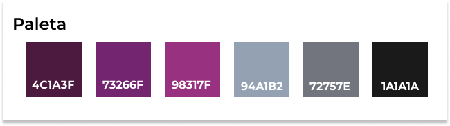
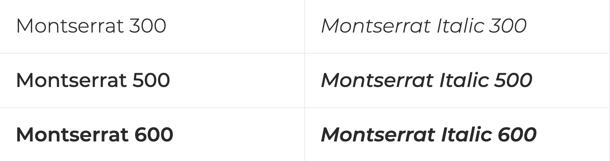
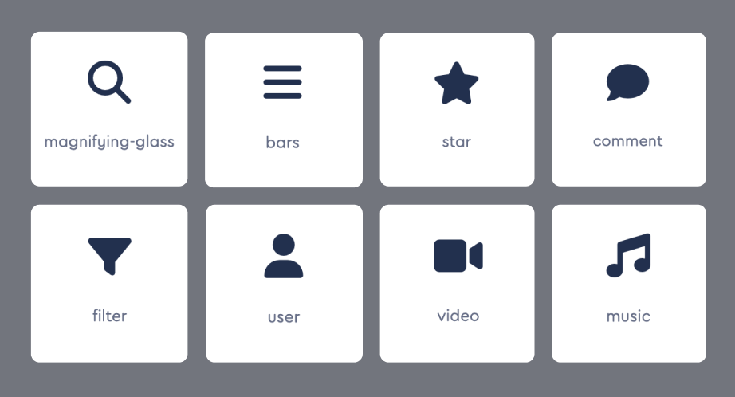

# Template padrão do site

## Design

Detalhe os layouts que serão utilizados. Apresente onde será colocado o logo do sistema. Defina os menus padrões, entre outras coisas.

## Cores.

## Tipografia

Para a tipografia decimos utilizar a fonte Montserrat que por sua vez possui uma licença gratuita para nossa utilização e um design bastante moderno e de facil leitura em dispositivos eletrônicos.

## Iconografia

Para os icones decidimos usar os modelos gratuitos disponibilizados através da plataforma Font Awesome.

